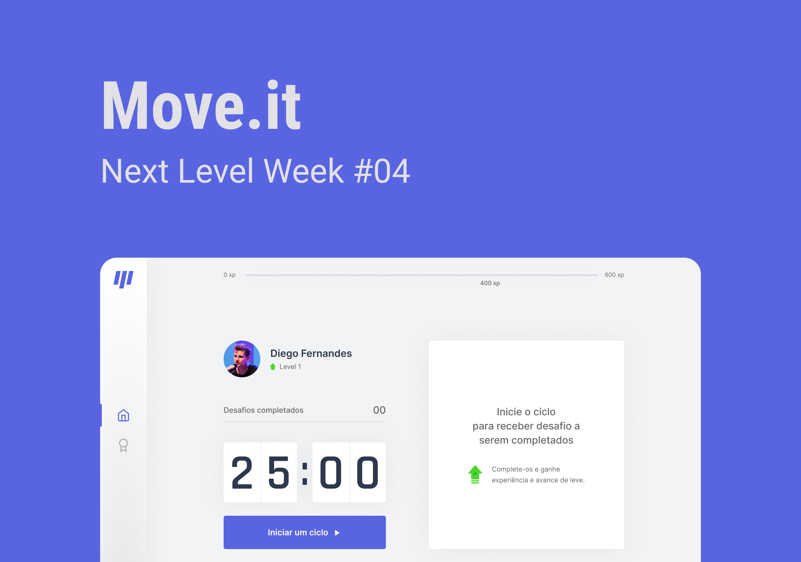

<h4 align="center">
    
    <br/>
    <br/>
</h4>

<p align="center">
  Next Level Week 4.0 🚀
  <br>
  <br>

  

  <a href="https://rocketseat.com.br">
    
  </a>

  <a href="https://github.com/LMThomaz/pomoFocus/commits/main">
    
  </a>

  
</p>

## :mag: Sobre o projeto

Com os trabalhos atuais, onde as pessoas esquecem de se movimentar e perdem o foco, assim foi desenvolvido este projeto que utiliza a técnica de pomodoro.
Desenvolvido durante a Next Level Week, oferecida pela [Rocketseat :rocket:][url-rocketseat] na trilha **ReactJS** :coffee:  
O NLW detêm muito conteúdo prático, desafios e hacks onde o conteúdo fica disponível durante uma semana.

## :art: O protótipo?

O layout da aplicação está disponível no [Figma  
 ][url-figma]

## :hammer: Tecnologias?

O projeto utiliza as seguintes ferramentas:

- [TypeScript][url-ts]
- [React][url-react]
- [NextJS][url-next]

## :electric_plug: Como usar?

É **necessário** que tenha instalado em sua máquina:

- [Git][url-git]
- [Node][url-node]
- [Yarn][url-yarn] ou [npm][url-npm]
- [VSCode][url-vs]

### :package: Obter a aplicação

Baixe o [.zip][url-zip] do projeto ou faça o clone executando:

```bash
$ git clone https://github.com/LMThomaz/pomoFocus
```

### :steam_locomotive: Instalar dependências

No diretório raiz da aplicação, abra o terminal e execute:

```bash
  # Caso esteja usando yarn
  yarn

  # Caso esteja usando npm
  npm i
```

### :crystal_ball: Executar aplicação

#### :computer: Versão desenvolvimento

Após as dependências instaladas, execute:

```bash
  # Caso esteja usando yarn
  yarn dev

  # Caso esteja usando npm
  npm dev
```

#### :office: Versão produção

Após as dependências instaladas, execute:

```bash
  # Caso esteja usando yarn
  yarn build

  #Após a geração do build
  yarn start
```

```bash
  # Caso esteja usando npm
  npm build

  #Após a geração do build
  npm start
```

---

## :coffee: Como posso ajudar?

1. Faça o Fork deste repositório
2. Comece uma branch com sua feature

```bash
$ git checkout -b minha-feature
```

3. Confirme (Commit) seus feitos

```bash
$ git commit -m 'Minha nova feature'
```

4. Suba (push) sua branch

```bash
$ git push origin minha-feature
```

## :mortar_board: Quem ministrou ?

As aulas foram ministradas pelo [Diego Fernandes][diego], nas aulas do **Next Level Week 4.0 - ReactJS** :rocket:

## :page_with_curl: Licença

O projeto está utilizando a licença MIT. Confira [LICENSE][license] para mais detalhes.

---

<h4 align="center">
Feito com 💜 por <a href="https://www.linkedin.com/in/leonardo-thomaz/" target="_blank">Leonardo Thomaz</a>
</h4>

[url-figma]: https://www.figma.com/file/nFtvmFEgK3Wi1PLDg307Zt/Move.it-1.0?node-id=160%3A2761
[url-ts]: https://www.typescriptlang.org/
[url-node]: https://nodejs.org/
[url-next]: https://nextjs.org/docs
[url-react]: https://reactjs.org/
[url-rocketseat]: https://rocketseat.com.br/
[url-git]: https://git-scm.com/
[url-vs]: https://code.visualstudio.com/
[url-npm]: https://www.npmjs.com/
[url-yarn]: https://yarnpkg.com/
[diego]: https://github.com/diego3g
[diego]: https://github.com/diego3g
[license]: https://github.com/LMThomaz/pomoFocus/blob/main/LICENSE.md
